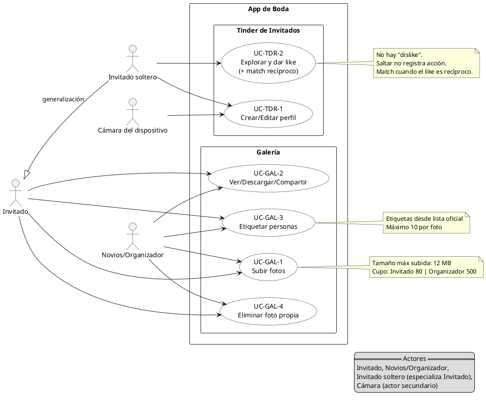
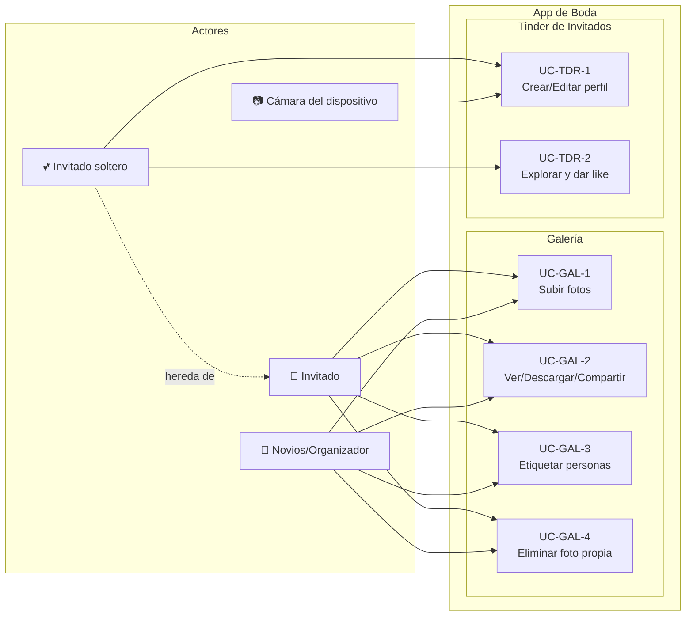

# Diagrama de Casos de Uso
## Aplicación de Organización de Casamientos
### Módulos: Galería de Fotos y Tinder de Invitados

---

## Diagrama PlantUML

---

## Diagrama Mermaid

---

## Descripción de Actores

### Actores Principales

#### Invitado
Usuario estándar de la aplicación. Puede acceder a todas las funcionalidades de la galería de fotos.

**Permisos:**
- Subir fotos (hasta 80)
- Ver, descargar y compartir fotos
- Etiquetar personas en fotos
- Eliminar sus propias fotos
- Agregar fotos a colecciones

#### Novios/Organizador
Usuario con permisos extendidos. Además de las funciones de Invitado, puede moderar contenido.

**Permisos adicionales:**
- Subir más fotos (hasta 500)
- Ocultar/mostrar fotos de otros
- Eliminar fotos de otros usuarios
- Ver reportes de actividad
- Acceder al panel de moderación

#### Invitado soltero (especialización de Invitado)
Usuario marcado como soltero en la lista de invitados. Hereda todos los permisos de Invitado y además puede acceder al módulo Tinder.

**Permisos adicionales:**
- Crear y editar perfil de Tinder
- Explorar perfiles de otros solteros
- Dar like a perfiles
- Chatear con matches

**Condición de acceso:**
- Bandera `esSoltero = true` en la lista de invitados
- Disponible desde la hora de inicio del casamiento

### Actores Secundarios

#### Cámara del dispositivo
Actor secundario que representa el hardware de cámara del dispositivo. Es necesario para capturar fotos para el perfil de Tinder.

**Interacción:**
- Captura de 1 a 6 fotos para el perfil
- No se permiten fotos de la galería del dispositivo

---

## Descripción de Casos de Uso

### Módulo: Galería de Fotos

#### UC-GAL-1: Subir fotos
**Actores:** Invitado, Novios/Organizador

**Descripción:** Permite a los usuarios cargar fotos desde la galería de su dispositivo a la galería compartida del evento.

**Precondiciones:**
- Usuario autenticado
- Galería habilitada (desde 2 días antes del casamiento)
- No exceder cupo personal (80 para Invitado, 500 para Organizador)

**Flujo principal:**
1. Usuario selecciona "Agregar foto"
2. Elige una o múltiples fotos de su galería
3. Sistema valida tamaño (≤12 MB) y resolución (≤36 MP)
4. Sistema valida cupo disponible
5. Sistema valida rate limit (10 fotos/5min, 60/hora)
6. Sistema sube las fotos y genera versiones (display, thumbnail)
7. Fotos aparecen en la galería con autor y fecha

**Flujos alternativos:**
- **A1:** Tamaño excedido → Mensaje de error con explicación
- **A2:** Cupo alcanzado → Bloqueo con sugerencia de eliminar fotos propias
- **A3:** Rate limit excedido → Mensaje con tiempo de espera

**Postcondiciones:**
- Fotos almacenadas en Google Drive
- Metadata guardada en base de datos
- Contador de cupo actualizado

**Notas:**
- Tamaño máx subida: 12 MB
- Cupo: Invitado 80 | Organizador 500

---

#### UC-GAL-2: Ver/Descargar/Compartir
**Actores:** Invitado, Novios/Organizador

**Descripción:** Permite a todos los usuarios ver las fotos en la galería, descargarlas a su dispositivo o compartirlas mediante link.

**Precondiciones:**
- Usuario autenticado
- Al menos una foto publicada en la galería

**Flujo principal - Ver:**
1. Usuario accede a la galería
2. Sistema muestra miniaturas en grid
3. Usuario selecciona una foto
4. Sistema abre vista de detalle con versión display
5. Usuario navega entre fotos con botones o swipe

**Flujo principal - Descargar:**
1. En vista de detalle, usuario presiona "Descargar"
2. Sistema descarga versión display al dispositivo
3. Confirmación de descarga exitosa

**Flujo principal - Compartir:**
1. En vista de detalle, usuario presiona "Compartir"
2. Sistema genera link público temporal
3. Usuario comparte el link por el medio que elija

**Postcondiciones:**
- Usuario puede acceder a las fotos offline (si las descargó)
- Link de compartir permite acceso directo a la foto

---

#### UC-GAL-3: Etiquetar personas
**Actores:** Invitado, Novios/Organizador

**Descripción:** Permite identificar personas en las fotos usando nombres de la lista oficial de invitados.

**Precondiciones:**
- Usuario autenticado
- Foto visible en la galería
- Lista oficial de invitados cargada
- Foto no tiene 10 etiquetas ya

**Flujo principal:**
1. Usuario abre foto en vista de detalle
2. Usuario presiona "Etiquetar"
3. Usuario hace click sobre una cara/persona en la foto
4. Sistema muestra campo de búsqueda con autocompletado
5. Usuario escribe nombre (autocompletado sugiere nombres de la lista)
6. Usuario selecciona un nombre de la lista
7. Sistema agrega etiqueta en esa posición
8. Etiqueta se guarda y aparece como badge

**Flujos alternativos:**
- **A1:** Nombre no está en la lista → No se permite agregar (sin etiquetas libres)
- **A2:** Ya hay 10 etiquetas → Mensaje de límite alcanzado

**Postcondiciones:**
- Etiqueta asociada a la foto
- Filtro por persona actualizado
- La foto aparece al filtrar por esa persona

**Notas:**
- Etiquetas desde lista oficial
- Máximo 10 por foto

---

#### UC-GAL-4: Eliminar foto propia
**Actores:** Invitado, Novios/Organizador

**Descripción:** Permite al autor de una foto eliminarla permanentemente para liberar cupo o por cambio de opinión.

**Precondiciones:**
- Usuario autenticado
- Usuario es el autor de la foto (o es Organizador)

**Flujo principal:**
1. Usuario abre su foto en vista de detalle
2. Usuario presiona "Eliminar"
3. Sistema solicita confirmación
4. Usuario confirma
5. Sistema elimina la foto permanentemente
6. Sistema libera el cupo del usuario
7. Foto desaparece de la galería

**Flujos alternativos:**
- **A1:** Usuario cancela → No se elimina nada
- **A2:** Organizador elimina foto de otro → Se registra en log de auditoría

**Postcondiciones:**
- Foto marcada como ELIMINADA
- Cupo del usuario decrementado
- URLs de la foto inaccesibles

---

### Módulo: Tinder de Invitados

#### UC-TDR-1: Crear/Editar perfil
**Actores:** Invitado soltero, Cámara del dispositivo (secundario)

**Descripción:** Permite a invitados solteros crear un perfil de Tinder con fotos capturadas en el momento, datos personales y preferencias de búsqueda.

**Precondiciones:**
- Usuario marcado como soltero (`esSoltero = true`)
- Disponible desde hora de inicio del casamiento
- Permiso de cámara otorgado

**Flujo principal - Crear:**
1. Usuario accede al módulo Tinder
2. Sistema muestra pantalla de cámara en vivo
3. Usuario captura entre 1 y 6 fotos
4. Usuario alterna entre cámara frontal/trasera si lo desea
5. Usuario revisa fotos en carrusel interno
6. Usuario presiona "Continuar"
7. Sistema muestra formulario de perfil
8. Usuario completa: nombre, edad, género, orientación, bio (≤280 chars)
9. Usuario configura preferencias: rango edad (18-80), géneros, orientaciones
10. Usuario presiona "Guardar perfil"
11. Sistema valida completitud (≥1 foto, todos los campos)
12. Sistema publica perfil y redirige al feed

**Flujo principal - Editar:**
1. Usuario accede a "Editar perfil" desde menú
2. Sistema muestra datos actuales
3. Usuario modifica campos deseados
4. Usuario puede capturar nuevas fotos con cámara
5. Usuario guarda cambios
6. Sistema actualiza perfil

**Flujos alternativos:**
- **A1:** Permiso de cámara denegado → No puede continuar, instrucciones para habilitar
- **A2:** Menos de 1 foto → Bloqueo con aviso
- **A3:** Bio >280 caracteres → Error de validación
- **A4:** Edad fuera de rango → Error de validación

**Postcondiciones:**
- Perfil activo y visible para otros usuarios según sus preferencias
- Usuario puede acceder al feed de exploración

---

#### UC-TDR-2: Explorar y dar like (+ match recíproco)
**Actores:** Invitado soltero

**Descripción:** Permite explorar perfiles de otros usuarios solteros según preferencias configuradas, dar like y generar matches cuando es recíproco.

**Precondiciones:**
- Perfil de Tinder creado y activo
- Al menos otro perfil disponible según preferencias

**Flujo principal:**
1. Usuario accede al feed de Tinder
2. Sistema muestra perfiles filtrados por preferencias (edad, género, orientación)
3. Usuario ve foto principal, nombre, edad y descripción del perfil
4. Usuario puede ver más fotos con swipe horizontal
5. Usuario decide:
   - **Like:** Presiona botón "Like" o swipe derecha
   - **Saltar:** Presiona botón "Saltar" o swipe izquierda
6. Si dio Like, sistema registra el like
7. Sistema verifica si el otro usuario ya había dado like
8. **Si hay match (like recíproco):**
   - Sistema genera Match
   - Muestra notificación pop-up con nombre del otro
   - Usuario puede ver perfil completo del match
   - Usuario puede iniciar chat
9. Sistema carga siguiente perfil

**Flujos alternativos:**
- **A1:** No hay más perfiles según preferencias → Mensaje "No hay más perfiles"
- **A2:** Rate limit de likes excedido (>200/hora) → Pausa con mensaje anti-abuso
- **A3:** Usuario cierra notificación de match → Match aparece en lista de chats

**Postcondiciones:**
- Likes registrados en sistema
- Matches generados están disponibles en pestaña "CHATS"
- Usuario no verá perfiles ya likeados o saltados inmediatamente

**Notas:**
- No hay "dislike"
- Saltar no registra acción
- Match cuando el like es recíproco

---

## Matriz de Trazabilidad: Casos de Uso vs Requisitos Funcionales

| Caso de Uso | RF relacionados | Prioridad |
|-------------|-----------------|-----------|
| UC-GAL-1: Subir fotos | RF-GAL-1 | MUST |
| UC-GAL-2: Ver/Descargar/Compartir | RF-GAL-2, RF-GAL-3 | MUST |
| UC-GAL-3: Etiquetar personas | RF-GAL-4, RF-GAL-5 | MUST |
| UC-GAL-4: Eliminar foto propia | RF-GAL-6 | SHOULD |
| UC-TDR-1: Crear/Editar perfil | RF-TDR-1 | MUST |
| UC-TDR-2: Explorar y dar like | RF-TDR-2, RF-TDR-3 | MUST |

---

## Casos de Uso Extendidos (No incluidos en diagrama principal)

### UC-GAL-5: Filtrar fotos
**Actores:** Invitado, Novios/Organizador  
**Descripción:** Filtrar galería por personas etiquetadas o colecciones de eventos  
**Relacionado con:** RF-GAL-5, RF-GAL-8

### UC-GAL-6: Agregar fotos a colecciones
**Actores:** Invitado, Novios/Organizador  
**Descripción:** Categorizar fotos en eventos/actividades específicas  
**Relacionado con:** RF-GAL-7

### UC-GAL-7: Moderar contenido
**Actores:** Novios/Organizador  
**Descripción:** Ocultar, mostrar o eliminar fotos inapropiadas  
**Relacionado con:** RNF-SEC-1, RNF-SEC-2

### UC-TDR-3: Chatear con matches
**Actores:** Invitado soltero  
**Descripción:** Enviar y recibir mensajes con usuarios con los que hizo match  
**Relacionado con:** RF-TDR-4

### UC-TDR-4: Editar preferencias de búsqueda
**Actores:** Invitado soltero  
**Descripción:** Modificar filtros de edad, género y orientación para el feed  
**Relacionado con:** RF-TDR-6

---

## Relaciones entre Casos de Uso

### Include (Inclusión)
- UC-GAL-1 **include** Validar cupo
- UC-GAL-1 **include** Validar tamaño y formato
- UC-GAL-3 **include** Autocompletar nombre desde lista de invitados
- UC-TDR-2 **include** Verificar match recíproco

### Extend (Extensión)
- Generar match **extends** UC-TDR-2 (cuando like es recíproco)
- Mostrar notificación **extends** Generar match
- Registrar auditoría **extends** UC-GAL-7 (moderación)

### Generalización
- Invitado soltero **generaliza** Invitado (hereda todos sus permisos)

---

**Documento generado para:** Aplicación de Organización de Casamientos  
**Versión:** 1.0  
**Fecha:** Noviembre 2025

