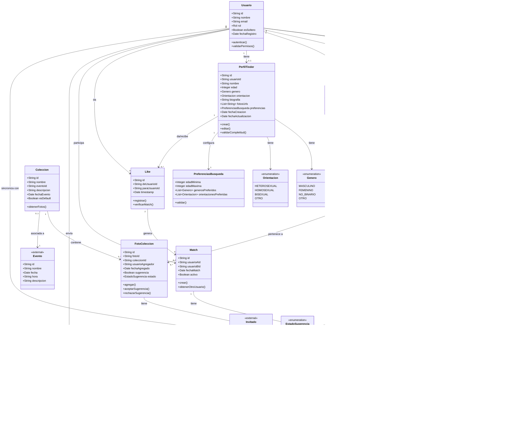

# Diagrama de Clases
## Aplicación de Organización de Casamientos
### Módulos: Galería de Fotos y Tinder de Invitados

---

## Diagrama Completo

---

## Descripción de Clases Principales

### Módulo: Galería de Fotos

#### Usuario
Representa a cualquier usuario del sistema (invitados y organizadores). Contiene información básica y determina los permisos según el rol.

**Atributos clave:**
- `rol`: Define si es INVITADO u ORGANIZADOR
- `esSoltero`: Determina acceso al módulo Tinder

#### Foto
Entidad central del módulo de galería. Almacena referencias a las tres versiones de la imagen (original, display, thumbnail) y su estado de moderación.

**Atributos clave:**
- `urlOriginal`, `urlDisplay`, `urlThumb`: URLs de las tres versiones
- `estado`: VISIBLE, OCULTA o ELIMINADA
- `tamanioBytes`: Validado contra límite de 12 MB
- `resolucionMP`: Validado contra límite de 36 MP

#### Etiqueta
Representa una persona identificada en una foto. Solo puede contener nombres de la lista oficial de invitados.

**Atributos clave:**
- `invitadoId`: Referencia externa a la lista de invitados
- `posicionX/Y`: Coordenadas de la etiqueta en la foto

**Restricciones:**
- Máximo 10 etiquetas por foto

#### Coleccion
Categoría o álbum que agrupa fotos por eventos/actividades. La mayoría se sincronizan con el módulo de Eventos/Actividades.

**Atributos clave:**
- `eventoId`: Referencia externa al módulo de Eventos
- `esDefault`: Indica si es la colección "General"

#### FotoColeccion
Tabla de relación N:M entre Foto y Colección. Permite que una foto pertenezca a múltiples colecciones y gestiona sugerencias.

**Atributos clave:**
- `sugerencia`: Indica si fue agregada por otro usuario
- `estado`: PENDIENTE, ACEPTADA, RECHAZADA si es sugerencia

#### AccionModeracion
Registro de auditoría inmutable de todas las acciones de moderación realizadas por organizadores.

**Atributos clave:**
- `accion`: OCULTAR, MOSTRAR, ELIMINAR, RESTAURAR
- `timestamp`: Momento exacto de la acción
- `motivo`: Justificación de la acción

---

### Módulo: Tinder de Invitados

#### PerfilTinder
Perfil del usuario soltero en el módulo Tinder. Solo existe si el usuario tiene la bandera `esSoltero = true`.

**Atributos clave:**
- `fotosUrls`: 1-6 fotos capturadas con la cámara
- `biografia`: Máximo 280 caracteres
- `preferencias`: Filtros para el feed

**Restricciones:**
- Solo disponible desde hora de inicio del casamiento

#### PreferenciasBusqueda
Configuración de filtros para determinar qué perfiles aparecen en el feed del usuario.

**Atributos clave:**
- `edadMinima/Maxima`: Rango 18-80 años
- `generosPreferidos`: Lista de géneros que le interesan
- `orientacionesPreferidas`: Lista de orientaciones

#### Like
Registro de interés de un usuario hacia otro. No hay "dislike" negativo.

**Métodos clave:**
- `verificarMatch()`: Consulta si el otro usuario también dio like

#### Match
Se crea cuando dos usuarios se dan like mutuamente. Habilita el chat entre ellos.

**Atributos clave:**
- `activo`: Permite desactivar el match sin eliminarlo

#### Chat
Conversación asociada a un match. Persiste indefinidamente después del evento.

**Atributos clave:**
- `ultimaActividad`: Para ordenar lista de chats

#### Mensaje
Mensaje individual dentro de un chat.

**Atributos clave:**
- `leido`: Estado de lectura para notificaciones

---

## Referencias Externas

### Invitado (Módulo: Lista de Invitados)
Fuente de verdad para datos de usuarios. Se consulta para:
- Validar acceso a Tinder (`esSoltero`)
- Autocompletar etiquetas en fotos

### Evento (Módulo: Eventos/Actividades)
Fuente de colecciones disponibles para categorizar fotos.

---

## Cardinalidades Importantes

| Relación | Cardinalidad | Descripción |
|----------|--------------|-------------|
| Usuario → Foto | 1:N | Un usuario puede subir múltiples fotos |
| Foto → Etiqueta | 1:N (máx 10) | Una foto puede tener hasta 10 etiquetas |
| Foto → Coleccion | N:M | Una foto puede estar en múltiples colecciones |
| Usuario → PerfilTinder | 1:0..1 | Solo si `esSoltero = true` |
| Like + Like → Match | 2:1 | Dos likes recíprocos generan un match |
| Match → Chat | 1:1 | Cada match tiene un chat asociado |
| Chat → Mensaje | 1:N | Un chat contiene múltiples mensajes |

---

## Notas Técnicas

### Validaciones en Foto
- Tamaño máximo subida: 12 MB
- Resolución máxima: 36 MP
- Formatos aceptados: JPG, JPEG, PNG, HEIC (convertidos a JPG)
- Generación automática de 3 versiones:
  - Original: almacenado tal cual (máx 36 MP)
  - Display: redimensionado a máx 2048px, ~1.5 MB
  - Thumbnail: redimensionado a máx 400px, ~100 KB

### Cupos de Fotos
- Invitado: máximo 80 fotos
- Organizador: máximo 500 fotos
- Evento: máximo 20,000 fotos totales

### Rate Limits
- Subida de fotos: 10/5min, 60/hora
- Likes en Tinder: 200/hora

---

**Documento generado para:** Aplicación de Organización de Casamientos  
**Versión:** 1.0  
**Fecha:** Noviembre 2025

