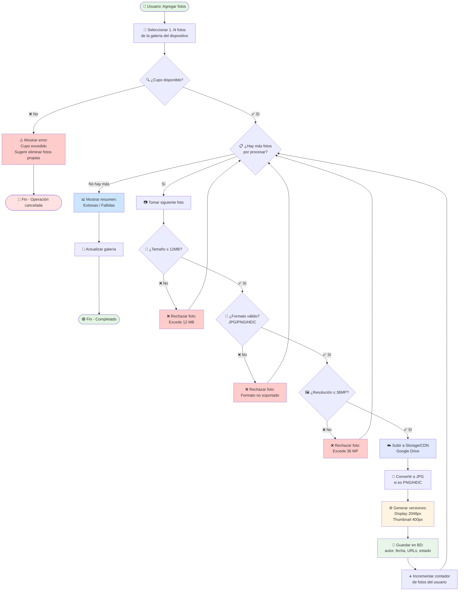
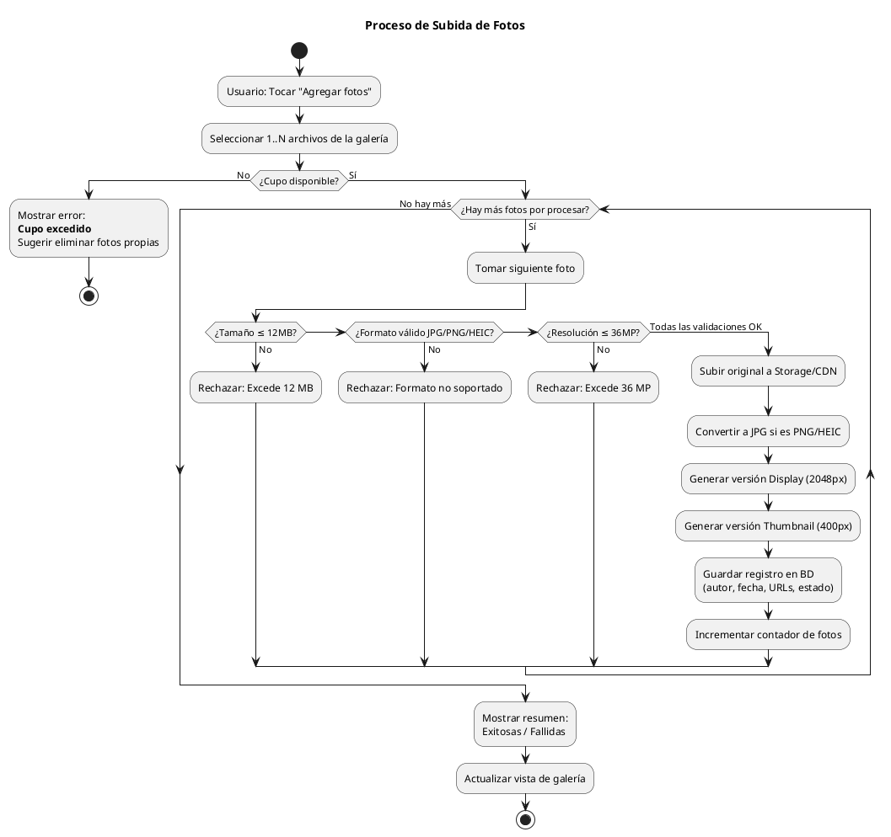
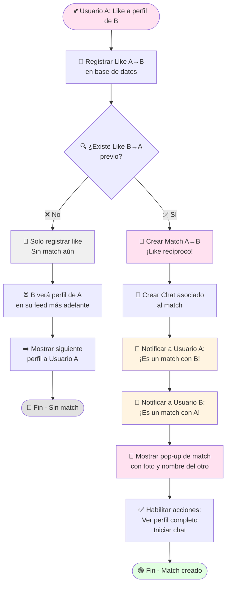
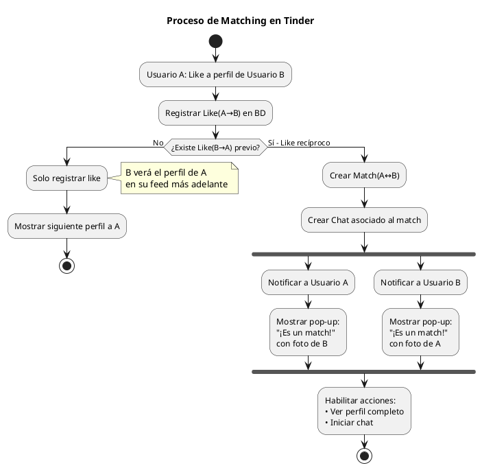
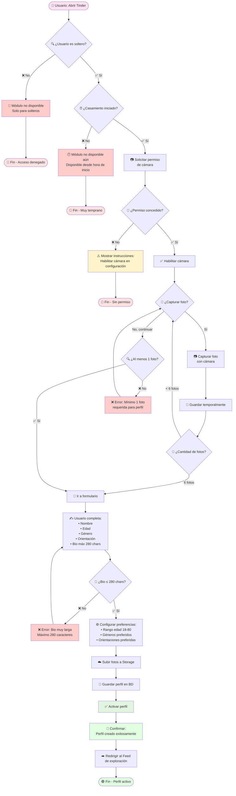
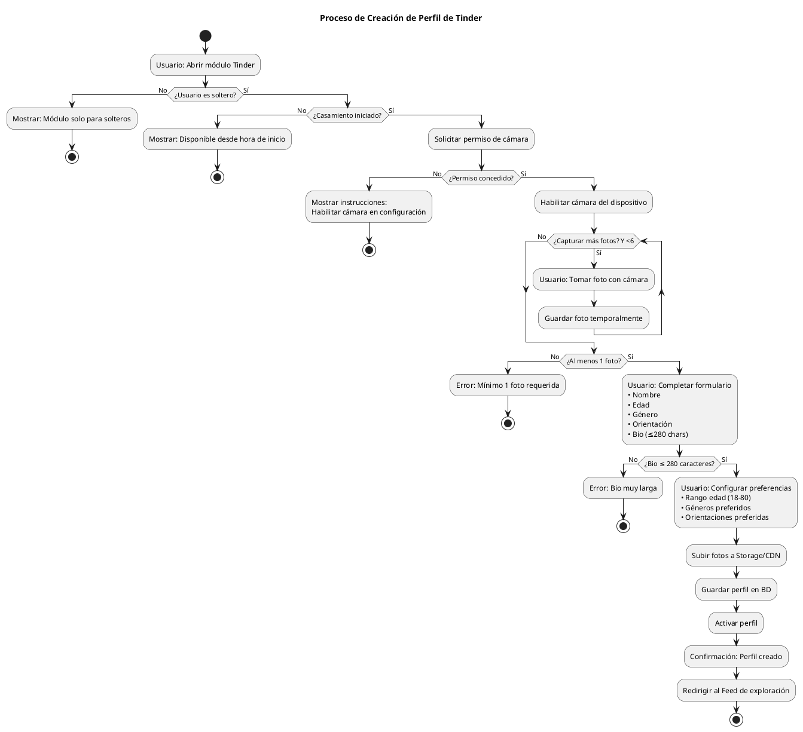

# Diagramas de Actividad
## Aplicación de Organización de Casamientos
### Módulos: Galería de Fotos y Tinder de Invitados

---

## Índice de Diagramas

1. [Proceso de Subida de Fotos](#1-proceso-de-subida-de-fotos)
2. [Proceso de Matching en Tinder](#2-proceso-de-matching-en-tinder)
3. [Proceso de Creación de Perfil de Tinder](#3-proceso-de-creación-de-perfil-de-tinder)

---

## 1. Proceso de Subida de Fotos

### Descripción
Este diagrama muestra el flujo completo desde que un usuario selecciona fotos hasta que se publican en la galería compartida. Incluye todas las validaciones necesarias: cupo disponible, tamaño de archivo, formato, y resolución. El proceso permite subida múltiple con resultados parciales (algunas fotos pueden ser aceptadas y otras rechazadas).

### Actores
- **Usuario**: Invitado u Organizador que sube fotos

### Validaciones incluidas
- ✅ Verificación de cupo disponible (80 para Invitado, 500 para Organizador)
- ✅ Tamaño de archivo ≤ 12 MB
- ✅ Formato válido: JPG, JPEG, PNG, HEIC
- ✅ Resolución ≤ 36 MP

### Procesos automatizados
- Conversión de PNG/HEIC a JPG
- Generación de versión Display (≤2048px, ~1.5MB)
- Generación de versión Thumbnail (≤400px, ~100KB)

### Diagrama



### Resultado esperado

Al finalizar el proceso, el usuario recibe un resumen:

**Ejemplo de resumen exitoso:**
```
✅ 5 de 5 fotos subidas correctamente
```

**Ejemplo de resumen parcial:**
```
✅ 3 de 5 fotos subidas correctamente
❌ 2 fotos rechazadas:
   • foto_beach.png - Excede 12 MB
   • foto_sunset.raw - Formato no soportado
```

**Ejemplo de rechazo total por cupo:**
```
❌ No se pueden subir fotos
Has alcanzado tu cupo de 80 fotos.
💡 Elimina algunas fotos para liberar espacio.
```

<details>
<summary>📄 Código PlantUML (click para expandir)</summary>



</details>

### Casos de error comunes

| Error | Causa | Acción sugerida |
|-------|-------|----------------|
| Cupo excedido | Usuario alcanzó 80/500 fotos | Eliminar fotos propias para liberar cupo |
| Tamaño excedido | Foto > 12 MB | Comprimir imagen antes de subir |
| Formato inválido | Archivo .raw, .bmp, .tiff | Convertir a JPG/PNG antes de subir |
| Resolución excedida | Foto > 36 MP (ej: 8000x5000) | Reducir resolución de la imagen |
| Rate limit | >10 fotos en 5 min | Esperar unos minutos antes de continuar |

---

## 2. Proceso de Matching en Tinder

### Descripción
Este diagrama muestra el flujo de decisión cuando un usuario da "like" a otro perfil en el módulo Tinder. El sistema verifica si existe un like recíproco para crear un match, o simplemente registra el like si no hay reciprocidad aún.

### Actores
- **Usuario A**: Invitado soltero que da like
- **Usuario B**: Invitado soltero que recibe like (puede haber dado like previamente)

### Reglas de negocio
- ✅ Match se crea solo cuando hay like recíproco (A→B y B→A)
- ✅ No existe acción "dislike" negativa
- ✅ Al crear match, se notifica instantáneamente a ambos usuarios
- ✅ El match habilita automáticamente un chat entre ambos

### Diagrama



### Flujos posibles

#### Escenario 1: Like sin match (más común inicialmente)
1. Usuario A da like a Usuario B
2. Sistema registra like(A→B)
3. Sistema verifica: ¿existe like(B→A)? → **No**
4. Solo se guarda el like
5. Usuario A continúa viendo perfiles
6. **Resultado**: B eventualmente verá el perfil de A y podrá hacer match

#### Escenario 2: Like con match inmediato
1. Usuario A da like a Usuario B
2. Sistema registra like(A→B)
3. Sistema verifica: ¿existe like(B→A)? → **Sí** (B ya había dado like a A previamente)
4. Sistema crea Match(A↔B)
5. Sistema crea Chat asociado
6. **Ambos** reciben notificación push simultáneamente
7. Se muestra pop-up: "¡Es un match! 💕"
8. **Resultado**: Ambos pueden chatear inmediatamente

### Estructura de datos resultante

**Like registrado:**
```json
{
  "id": "like_abc123",
  "deUsuarioId": "usr_A",
  "paraUsuarioId": "usr_B",
  "timestamp": "2025-11-05T18:30:00Z"
}
```

**Match creado (cuando es recíproco):**
```json
{
  "id": "match_xyz789",
  "usuarioAId": "usr_A",
  "usuarioBId": "usr_B",
  "fechaMatch": "2025-11-05T18:30:00Z",
  "activo": true,
  "chatId": "chat_999"
}
```

<details>
<summary>📄 Código PlantUML (click para expandir)</summary>



</details>

### Notificaciones Push

Cuando se produce un match, ambos usuarios reciben:

**Título:** "¡Es un match! 💕"

**Contenido:** "A [Nombre del otro] le gustas"

**Acción al tocar:** Abre el perfil del match con opción de iniciar chat

---

## 3. Proceso de Creación de Perfil de Tinder

### Descripción
Este diagrama muestra el flujo completo para que un invitado soltero cree su perfil en el módulo Tinder. El proceso incluye la solicitud de permisos de cámara, captura de fotos, completado del formulario con datos personales y configuración de preferencias de búsqueda.

### Actores
- **Usuario**: Invitado soltero (con bandera `esSoltero = true`)
- **Cámara del dispositivo**: Hardware necesario para capturar fotos

### Precondiciones
- Usuario marcado como soltero en la lista de invitados
- Módulo Tinder disponible (desde hora de inicio del casamiento)
- Dispositivo con cámara funcional

### Restricciones importantes
- ⚠️ **Solo fotos de cámara**: No se permiten fotos de la galería del dispositivo
- 📸 **Rango de fotos**: Mínimo 1, máximo 6 fotos
- ✍️ **Bio limitada**: Máximo 280 caracteres
- 🎂 **Rango de edad**: 18-80 años

### Diagrama



### Validaciones del formulario

| Campo | Validación | Mensaje de error |
|-------|-----------|------------------|
| Fotos | 1-6 fotos | "Debes tener al menos 1 foto" o "Máximo 6 fotos" |
| Nombre | No vacío | "El nombre es obligatorio" |
| Edad | Número válido | "Ingresa una edad válida" |
| Género | Selección obligatoria | "Selecciona tu género" |
| Orientación | Selección obligatoria | "Selecciona tu orientación" |
| Bio | ≤ 280 caracteres | "La biografía no puede exceder 280 caracteres" |
| Pref. Edad | 18-80 años | "Rango de edad debe estar entre 18 y 80" |
| Pref. Género | Al menos 1 | "Selecciona al menos un género de interés" |
| Pref. Orientación | Al menos 1 | "Selecciona al menos una orientación" |

### Ejemplo de perfil completo

```json
{
  "id": "perfil_123",
  "usuarioId": "usr_456",
  "nombre": "María García",
  "edad": 28,
  "genero": "FEMENINO",
  "orientacion": "BISEXUAL",
  "biografia": "🍷 Sommelier amateur | 🏔️ Montañista los fines de semana | 📚 Siempre con un libro en la mochila. Me encanta viajar y conocer nuevas culturas.",
  "fotosUrls": [
    "https://cdn.example.com/perfil_123_foto1.jpg",
    "https://cdn.example.com/perfil_123_foto2.jpg",
    "https://cdn.example.com/perfil_123_foto3.jpg"
  ],
  "preferencias": {
    "edadMinima": 25,
    "edadMaxima": 35,
    "generosPreferidos": ["MASCULINO", "FEMENINO"],
    "orientacionesPreferidas": ["HETEROSEXUAL", "BISEXUAL", "HOMOSEXUAL"]
  },
  "fechaCreacion": "2025-11-05T10:00:00Z",
  "activo": true
}
```

<details>
<summary>📄 Código PlantUML (click para expandir)</summary>



</details>

### Estados del perfil

Un perfil de Tinder puede tener los siguientes estados:

| Estado | Descripción | Visible en feed |
|--------|-------------|----------------|
| **Borrador** | Perfil incompleto, en proceso de creación | ❌ No |
| **Activo** | Perfil completo y publicado | ✅ Sí |
| **Pausado** | Usuario pausó temporalmente su perfil | ❌ No |
| **Inactivo** | Usuario desactivó su perfil | ❌ No |

### Edición de perfil

Una vez creado el perfil, el usuario puede:
- ✏️ Editar bio, edad, género, orientación
- 📸 Capturar nuevas fotos (reemplazando las anteriores)
- ⚙️ Modificar preferencias de búsqueda
- ⏸️ Pausar/reactivar perfil
- 🗑️ Eliminar perfil completamente

---

## Resumen de Diagramas

| Diagrama | Complejidad | Decisiones clave | Loops |
|----------|-------------|------------------|-------|
| **Subida de Fotos** | Alta | 4 validaciones (cupo, tamaño, formato, resolución) | Sí (por cada foto) |
| **Matching** | Media | 1 decisión (like recíproco) | No |
| **Creación de Perfil** | Alta | 5 validaciones (permisos, fotos, bio, edad, preferencias) | Sí (captura de fotos) |

---

## Convenciones utilizadas

### Símbolos
- 🔴 Fin con error/cancelación
- 🟢 Fin exitoso
- ⚠️ Advertencia
- ❌ Validación fallida
- ✅ Validación exitosa
- 🔍 Verificación/consulta
- 💾 Almacenamiento
- 📱 Interacción con UI
- 🔔 Notificación
- ⏳ Espera/proceso asíncrono

### Colores (en diagramas Mermaid)
- **Verde claro**: Inicio exitoso / Fin exitoso
- **Rojo claro**: Fin con error
- **Amarillo claro**: Advertencias / Notificaciones
- **Azul claro**: Resúmenes / Información
- **Gris claro**: Estados neutrales

---

**Documento generado para:** Aplicación de Organización de Casamientos  
**Versión:** 1.0  
**Fecha:** Noviembre 2025

