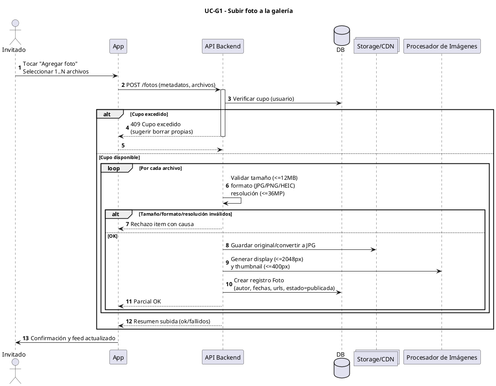
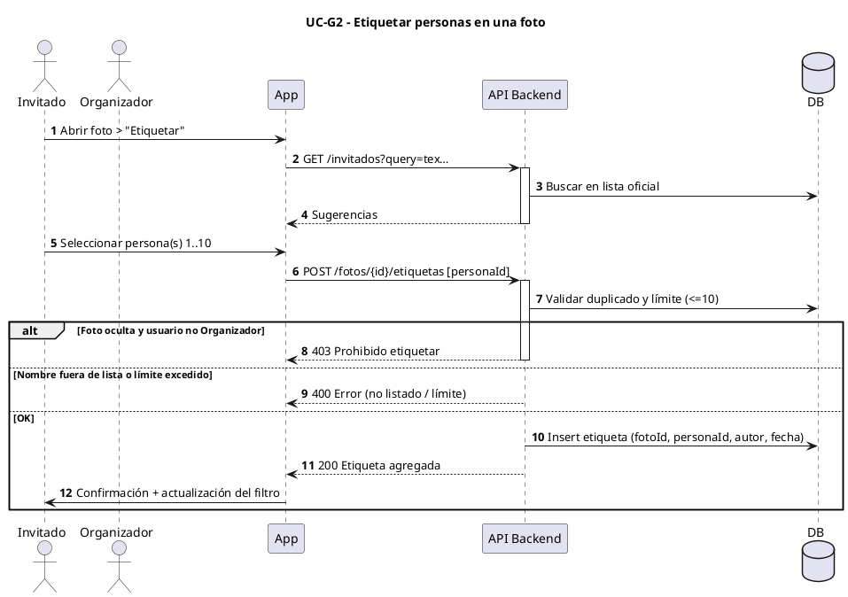
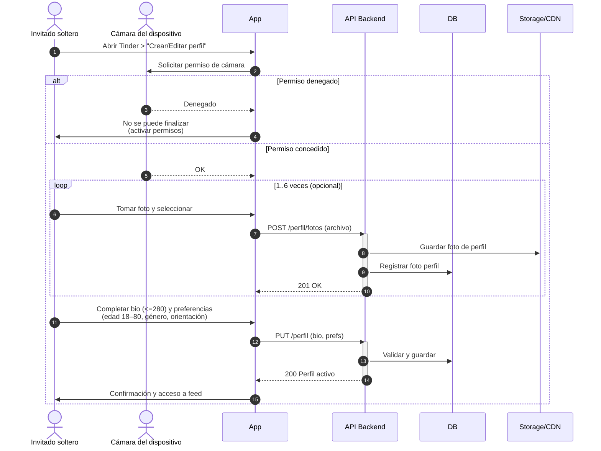
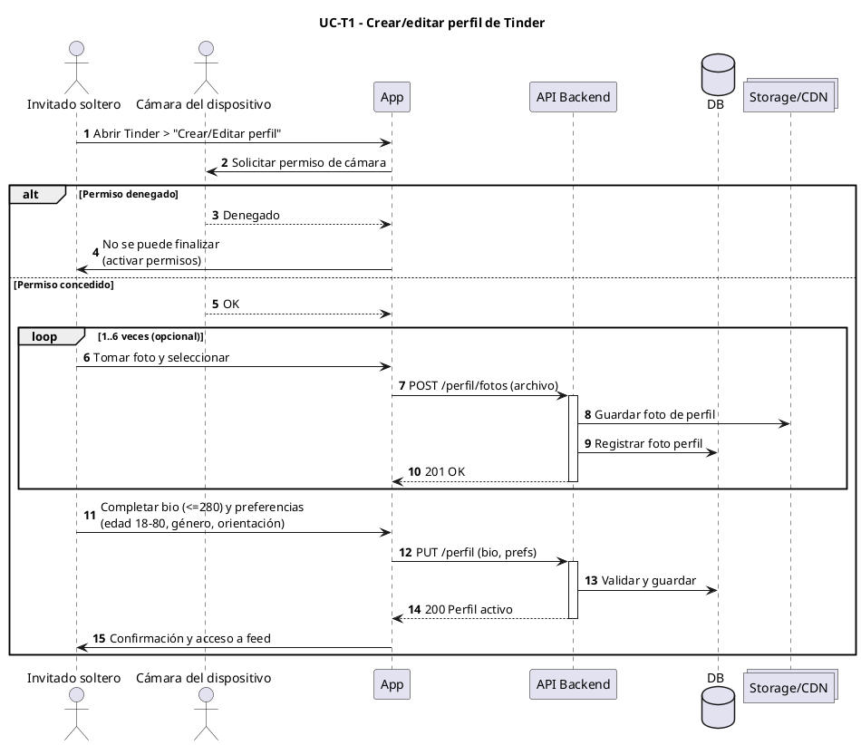
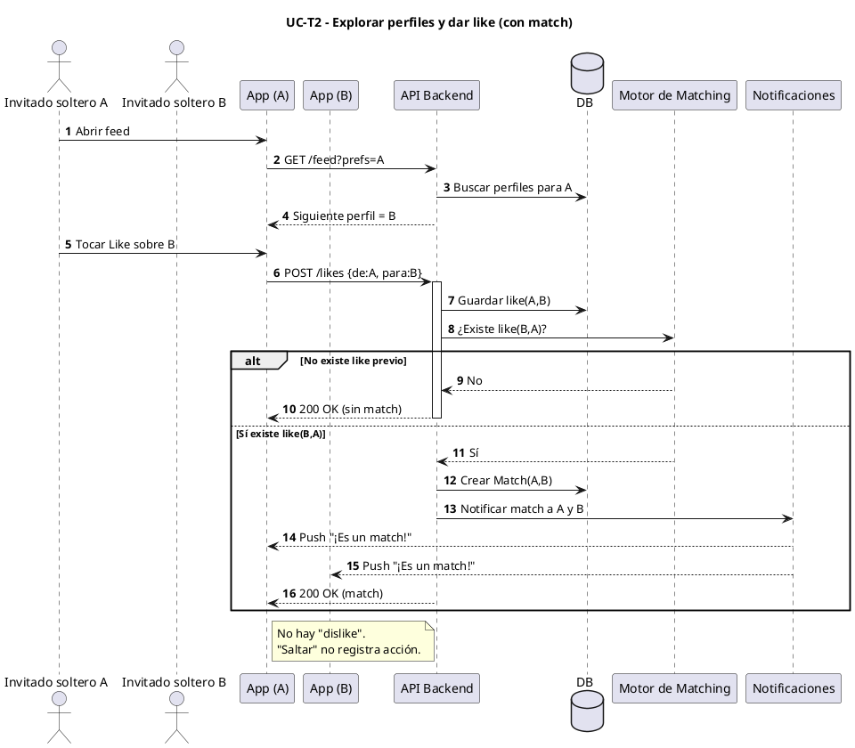

# Diagramas de Secuencia
## Aplicación de Organización de Casamientos
### Módulos: Galería de Fotos y Tinder de Invitados

---

## Índice de Diagramas

1. [UC-G1: Subir foto a la galería](#uc-g1-subir-foto-a-la-galería)
2. [UC-G2: Etiquetar personas en una foto](#uc-g2-etiquetar-personas-en-una-foto)
3. [UC-T1: Crear/editar perfil de Tinder](#uc-t1-creareditar-perfil-de-tinder)
4. [UC-T2: Explorar perfiles y dar like (con match)](#uc-t2-explorar-perfiles-y-dar-like-con-match)

---

## UC-G1: Subir foto a la galería

### Descripción
Este diagrama muestra el flujo completo de subida de una o múltiples fotos a la galería compartida del evento, incluyendo validaciones de cupo, tamaño, formato y resolución, así como el procesamiento de las imágenes para generar versiones optimizadas.

### Actores y Participantes
- **Invitado/Organizador**: Usuario que sube la foto
- **App**: Aplicación frontend (móvil/web)
- **API Backend**: Servidor que procesa las peticiones
- **DB**: Base de datos
- **Storage/CDN**: Almacenamiento de archivos (Google Drive)
- **Procesador de Imágenes**: Servicio para generar versiones display y thumbnail

### Flujo Principal
1. Usuario selecciona fotos desde su dispositivo
2. Se valida el cupo disponible del usuario
3. Por cada foto se valida: tamaño (≤12MB), formato (JPG/PNG/HEIC), resolución (≤36MP)
4. Si es válida, se guarda en storage y se generan las versiones optimizadas
5. Se registra en base de datos con metadata
6. Se devuelve resumen de subida (exitosas/fallidas)

### Flujos Alternativos
- **Cupo excedido**: Se rechaza toda la operación con sugerencia de eliminar fotos propias
- **Validación fallida**: Se rechaza ese archivo específico con causa detallada
- **Subida parcial**: Se publican las fotos válidas y se reportan las fallidas

### Diagrama (Mermaid - se visualiza en GitHub)

```mermaid
sequenceDiagram
    autonumber
    actor U as Invitado
    participant App
    participant API as API Backend
    participant DB
    participant CDN as Storage/CDN
    participant IMG as Procesador de Imágenes

    U->>App: Tocar "Agregar foto"<br/>Seleccionar 1..N archivos
    App->>API: POST /fotos (metadatos, archivos)
    activate API
    
    API->>DB: Verificar cupo (usuario)
    
    alt Cupo excedido
        API-->>App: 409 Cupo excedido<br/>(sugerir borrar propias)
        deactivate API
    else Cupo disponible
        loop Por cada archivo
            API->>API: Validar tamaño (<=12MB)<br/>formato (JPG/PNG/HEIC)<br/>resolución (<=36MP)
            
            alt Tamaño/formato/resolución inválidos
                API-->>App: Rechazo item con causa
            else OK
                API->>CDN: Guardar original/convertir a JPG
                API->>IMG: Generar display (<=2048px)<br/>y thumbnail (<=400px)
                API->>DB: Crear registro Foto<br/>(autor, fechas, urls, estado=publicada)
                API-->>App: Parcial OK
            end
        end
        API-->>App: Resumen subida (ok/fallidos)
        deactivate API
    end
    
    App->>U: Confirmación y feed actualizado
```

<details>
<summary>📄 Código PlantUML (click para expandir)</summary>



</details>

### Validaciones Críticas
| Validación | Límite | Respuesta si falla |
|------------|--------|-------------------|
| Cupo usuario | 80 (Invitado) / 500 (Organizador) | 409 Conflict - Sugerir eliminar fotos propias |
| Tamaño archivo | ≤ 12 MB | 400 Bad Request - "Foto excede 12 MB" |
| Resolución | ≤ 36 MP | 400 Bad Request - "Resolución excede 36 MP" |
| Formato | JPG/JPEG/PNG/HEIC | 400 Bad Request - "Formato no soportado" |
| Rate limit | 10 fotos/5min, 60/hora | 429 Too Many Requests |

### Versiones de Imagen Generadas
- **Original**: Almacenada tal cual (máx 36 MP, convertida a JPG si es PNG/HEIC)
- **Display**: Redimensionada a máx 2048px, ~1.5 MB (para vista detalle)
- **Thumbnail**: Redimensionada a máx 400px, ~100 KB (para galería/grid)

---

## UC-G2: Etiquetar personas en una foto

### Descripción
Este diagrama muestra el proceso de etiquetado de personas en las fotos usando exclusivamente nombres de la lista oficial de invitados, con autocompletado y validación de límites.

### Actores y Participantes
- **Invitado/Organizador**: Usuario que etiqueta la foto
- **App**: Aplicación frontend
- **API Backend**: Servidor que procesa las peticiones
- **DB**: Base de datos

### Flujo Principal
1. Usuario abre una foto y selecciona "Etiquetar"
2. Usuario comienza a escribir un nombre
3. Sistema consulta lista oficial de invitados y muestra sugerencias
4. Usuario selecciona una o más personas (máximo 10 por foto)
5. Sistema valida que el nombre esté en la lista y no exceda el límite
6. Se guarda la etiqueta con referencia al invitado

### Flujos Alternativos
- **Foto oculta**: Solo Organizador puede etiquetar
- **Nombre no listado**: Se rechaza (no se permiten etiquetas libres)
- **Límite excedido**: Se rechaza si ya hay 10 etiquetas

### Diagrama (Mermaid - se visualiza en GitHub)

```mermaid
sequenceDiagram
    autonumber
    actor U as Invitado
    participant App
    participant API as API Backend
    participant DB

    U->>App: Abrir foto > "Etiquetar"
    App->>API: GET /invitados?query=tex…
    activate API
    API->>DB: Buscar en lista oficial
    API-->>App: Sugerencias
    deactivate API

    U->>App: Seleccionar persona(s) 1..10
    App->>API: POST /fotos/{id}/etiquetas [personaId]
    activate API
    API->>DB: Validar duplicado y límite (<=10)

    alt Foto oculta y usuario no Organizador
        API-->>App: 403 Prohibido etiquetar
        deactivate API
    else Nombre fuera de lista o límite excedido
        API-->>App: 400 Error (no listado / límite)
        deactivate API
    else OK
        API->>DB: Insert etiqueta (fotoId, personaId, autor, fecha)
        API-->>App: 200 Etiqueta agregada
        deactivate API
        App->>U: Confirmación + actualización del filtro
    end
```

<details>
<summary>📄 Código PlantUML (click para expandir)</summary>



</details>

### Reglas de Negocio
- **Etiquetas solo de lista oficial**: No se permiten nombres que no estén en la lista de invitados
- **Máximo 10 etiquetas por foto**: Límite técnico para evitar saturación
- **Autocompletado obligatorio**: No hay campo de texto libre, solo selección de sugerencias
- **Fotos ocultas**: Solo el Organizador puede etiquetar fotos ocultas

### Estructura de Etiqueta

```json
{
  "id": "etq_123",
  "fotoId": "foto_456",
  "invitadoId": "inv_789",
  "nombrePersona": "Juan Pérez",
  "posicionX": 45,
  "posicionY": 60,
  "autorEtiqueta": "usr_012",
  "fechaCreacion": "2025-11-05T14:30:00Z"
}
```

---

## UC-T1: Crear/editar perfil de Tinder

### Descripción
Este diagrama muestra el proceso completo de creación o edición de un perfil de Tinder, incluyendo la captura de fotos con la cámara del dispositivo (no se permiten fotos de galería), la configuración de datos personales y preferencias de búsqueda.

### Actores y Participantes
- **Invitado soltero**: Usuario con bandera `esSoltero = true`
- **Cámara del dispositivo**: Hardware de cámara (actor secundario)
- **App**: Aplicación frontend
- **API Backend**: Servidor que procesa las peticiones
- **DB**: Base de datos
- **Storage/CDN**: Almacenamiento de fotos de perfil

### Flujo Principal
1. Usuario accede al módulo Tinder (solo disponible si es soltero y desde hora de inicio del evento)
2. Sistema solicita permiso de cámara
3. Usuario captura entre 1 y 6 fotos usando la cámara
4. Cada foto se sube inmediatamente al storage
5. Usuario completa formulario: nombre, edad, género, orientación, bio (≤280 chars)
6. Usuario configura preferencias de búsqueda: rango de edad (18-80), géneros, orientaciones
7. Sistema valida completitud (≥1 foto, campos obligatorios)
8. Perfil se publica y usuario obtiene acceso al feed

### Flujos Alternativos
- **Permiso de cámara denegado**: No puede continuar, se muestran instrucciones para habilitar
- **Menos de 1 foto**: Se bloquea el botón guardar
- **Bio >280 caracteres**: Error de validación
- **Edad fuera de rango**: Error de validación

### Diagrama (Mermaid - se visualiza en GitHub)



<details>
<summary>📄 Código PlantUML (click para expandir)</summary>



</details>

### Validaciones del Perfil

| Campo | Validación | Error si falla |
|-------|-----------|---------------|
| Fotos | 1-6 fotos | "Debes tener al menos 1 foto" |
| Bio | ≤ 280 caracteres | "La biografía no puede exceder 280 caracteres" |
| Edad | Número válido | "Edad inválida" |
| Género | Selección obligatoria | "Selecciona tu género" |
| Orientación | Selección obligatoria | "Selecciona tu orientación" |
| Pref. Edad | 18-80 años | "Rango de edad inválido (18-80)" |
| Pref. Género | Al menos 1 seleccionado | "Selecciona al menos un género" |
| Pref. Orientación | Al menos 1 seleccionado | "Selecciona al menos una orientación" |

### Estructura de PerfilTinder

```json
{
  "id": "perfil_123",
  "usuarioId": "usr_456",
  "nombre": "María García",
  "edad": 28,
  "genero": "FEMENINO",
  "orientacion": "BISEXUAL",
  "biografia": "Amante del vino y los viajes. Siempre lista para una aventura.",
  "fotosUrls": [
    "https://cdn.example.com/perfil_123_foto1.jpg",
    "https://cdn.example.com/perfil_123_foto2.jpg",
    "https://cdn.example.com/perfil_123_foto3.jpg"
  ],
  "preferencias": {
    "edadMinima": 25,
    "edadMaxima": 35,
    "generosPreferidos": ["MASCULINO", "FEMENINO"],
    "orientacionesPreferidas": ["HETEROSEXUAL", "BISEXUAL", "HOMOSEXUAL"]
  },
  "fechaCreacion": "2025-11-05T10:00:00Z",
  "fechaActualizacion": "2025-11-05T10:15:00Z"
}
```

### Restricción: Solo Fotos de Cámara
⚠️ **Importante**: Las fotos del perfil de Tinder **solo** pueden ser capturadas con la cámara de la aplicación. No se permite subir fotos de la galería del dispositivo. Esta restricción busca garantizar autenticidad y fotos recientes.

---

## UC-T2: Explorar perfiles y dar like (con match)

### Descripción
Este diagrama muestra el flujo de exploración de perfiles en el feed de Tinder, la acción de dar like, y la lógica de matching cuando dos usuarios se dan like mutuamente. Incluye la notificación instantánea a ambos usuarios cuando se produce un match.

### Actores y Participantes
- **Invitado soltero A**: Usuario que da like
- **Invitado soltero B**: Usuario que recibe like (puede haberlo dado previamente)
- **App (A) / App (B)**: Aplicaciones de cada usuario
- **API Backend**: Servidor que procesa las peticiones
- **DB**: Base de datos
- **Motor de Matching**: Componente que verifica likes recíprocos
- **Notificaciones**: Servicio de notificaciones push

### Flujo Principal
1. Usuario A abre el feed de Tinder
2. Sistema consulta perfiles filtrados según preferencias de A
3. Sistema muestra perfil de B (con fotos, nombre, edad, descripción)
4. Usuario A da like a B
5. Sistema registra el like(A→B) en base de datos
6. Motor de Matching verifica si existe like(B→A) previo
7. **Si hay like recíproco:**
   - Se crea un Match(A,B)
   - Se notifica a ambos usuarios inmediatamente
   - Aparece pop-up "¡Es un match!" con acceso al perfil y chat
8. **Si no hay like previo:**
   - Solo se registra el like
   - B verá el perfil de A en su feed y podrá matchear más adelante

### Flujos Alternativos
- **Saltar perfil**: No se registra ninguna acción (no hay dislike)
- **Sin más perfiles**: Mensaje "No hay más perfiles según tus preferencias"
- **Rate limit excedido**: Pausa temporal con mensaje (>200 likes/hora)

### Diagrama (Mermaid - se visualiza en GitHub)

```mermaid
sequenceDiagram
    autonumber
    actor A as Invitado soltero A
    actor B as Invitado soltero B
    participant AppA as App (A)
    participant AppB as App (B)
    participant API as API Backend
    participant DB
    participant MM as Motor de Matching
    participant Notif as Notificaciones

    A->>AppA: Abrir feed
    AppA->>API: GET /feed?prefs=A
    API->>DB: Buscar perfiles para A
    API-->>AppA: Siguiente perfil = B

    A->>AppA: Tocar Like sobre B
    AppA->>API: POST /likes {de:A, para:B}
    activate API
    API->>DB: Guardar like(A,B)
    API->>MM: ¿Existe like(B,A)?

    alt No existe like previo
        MM-->>API: No
        API-->>AppA: 200 OK (sin match)
        deactivate API
    else Sí existe like(B,A)
        MM-->>API: Sí
        API->>DB: Crear Match(A,B)
        API->>Notif: Notificar match a A y B
        Notif-->>AppA: Push "¡Es un match!"
        Notif-->>AppB: Push "¡Es un match!"
        API-->>AppA: 200 OK (match)
        deactivate API
    end

    Note over AppA: No hay "dislike".<br/>Saltar no registra acción.
```

<details>
<summary>📄 Código PlantUML (click para expandir)</summary>



</details>

### Lógica de Matching

```javascript
// Pseudocódigo del Motor de Matching
function verificarMatch(likeNuevo) {
  // like(A → B) acaba de registrarse
  const usuarioA = likeNuevo.deUsuarioId;
  const usuarioB = likeNuevo.paraUsuarioId;
  
  // Buscar si existe like(B → A) previo
  const likeRecíproco = db.likes.findOne({
    deUsuarioId: usuarioB,
    paraUsuarioId: usuarioA
  });
  
  if (likeRecíproco) {
    // ¡Match!
    const match = db.matches.create({
      usuarioAId: usuarioA,
      usuarioBId: usuarioB,
      fechaMatch: Date.now()
    });
    
    // Crear chat asociado
    db.chats.create({
      matchId: match.id,
      fechaInicio: Date.now()
    });
    
    // Notificar a ambos
    notificaciones.enviar(usuarioA, {
      tipo: "MATCH",
      mensaje: "¡Es un match con " + usuarioB.nombre + "!",
      perfilId: usuarioB.id
    });
    
    notificaciones.enviar(usuarioB, {
      tipo: "MATCH",
      mensaje: "¡Es un match con " + usuarioA.nombre + "!",
      perfilId: usuarioA.id
    });
    
    return { match: true, matchId: match.id };
  } else {
    // Solo se registró el like, sin match (por ahora)
    return { match: false };
  }
}
```

### Algoritmo de Feed

El feed muestra perfiles según los siguientes criterios:

1. **Filtrado por preferencias del usuario:**
   - Edad dentro del rango configurado
   - Género coincide con preferencias
   - Orientación coincide con preferencias

2. **Exclusión de perfiles:**
   - Ya likeados por el usuario
   - Ya saltados recientemente (últimas 24 horas)
   - Con match existente

3. **Orden aleatorio:**
   - Los perfiles se muestran en orden aleatorio dentro de los filtros
   - Evita que siempre aparezcan los mismos primeros

### Estructura de Like

```json
{
  "id": "like_123",
  "deUsuarioId": "usr_456",
  "paraUsuarioId": "usr_789",
  "timestamp": "2025-11-05T15:30:00Z"
}
```

### Estructura de Match

```json
{
  "id": "match_123",
  "usuarioAId": "usr_456",
  "usuarioBId": "usr_789",
  "fechaMatch": "2025-11-05T15:30:00Z",
  "activo": true,
  "chatId": "chat_999"
}
```

### Notificaciones Push

Cuando se produce un match, ambos usuarios reciben una notificación instantánea:

**Contenido de la notificación:**
- Título: "¡Es un match! 💕"
- Mensaje: "A [Nombre] le gustas"
- Acción: Al tocar, abre el perfil del match con opción de iniciar chat

### Reglas Importantes

❌ **No hay "dislike"**: No existe una acción para rechazar explícitamente un perfil. Solo se puede "saltar", que no registra ninguna acción negativa.

✅ **Saltar es neutral**: Al saltar un perfil, no se guarda ningún registro. El perfil podría volver a aparecer en el futuro (aunque con baja prioridad).

🔒 **Rate limit anti-abuso**: Máximo 200 likes por hora para prevenir spam o uso indebido del sistema.

♾️ **Matches persistentes**: Los matches y chats persisten indefinidamente después del evento, permitiendo mantener el contacto.

---

## Resumen de Endpoints API

### Galería de Fotos

| Método | Endpoint | Descripción |
|--------|----------|-------------|
| POST | `/fotos` | Subir una o múltiples fotos |
| GET | `/fotos` | Obtener lista de fotos (con paginación) |
| GET | `/fotos/{id}` | Obtener detalle de una foto |
| DELETE | `/fotos/{id}` | Eliminar foto propia |
| GET | `/invitados?query={texto}` | Buscar invitados para etiquetas |
| POST | `/fotos/{id}/etiquetas` | Agregar etiqueta a foto |
| DELETE | `/fotos/{id}/etiquetas/{etiquetaId}` | Eliminar etiqueta |

### Tinder de Invitados

| Método | Endpoint | Descripción |
|--------|----------|-------------|
| POST | `/perfil` | Crear perfil de Tinder |
| PUT | `/perfil` | Editar perfil |
| GET | `/perfil` | Obtener perfil propio |
| POST | `/perfil/fotos` | Subir foto de perfil |
| GET | `/feed` | Obtener siguiente perfil según preferencias |
| POST | `/likes` | Registrar like |
| GET | `/matches` | Obtener lista de matches |
| GET | `/matches/{id}/chat` | Obtener mensajes de un chat |
| POST | `/matches/{id}/chat/mensajes` | Enviar mensaje |

---

## Consideraciones Técnicas

### Procesamiento Asíncrono
El procesamiento de imágenes (generación de versiones display y thumbnail) debe ejecutarse de forma asíncrona para no bloquear la respuesta al usuario:

1. **Subida inicial**: Se guarda el original y se responde al usuario
2. **Cola de procesamiento**: Se encola job para generar versiones optimizadas
3. **Procesamiento en background**: Worker procesa las imágenes
4. **Actualización**: Una vez listas, se actualizan las URLs en base de datos
5. **Notificación**: Se puede notificar al usuario cuando las versiones están listas (opcional)

### Manejo de Errores

Todos los endpoints deben devolver códigos HTTP apropiados y mensajes claros:

| Código | Significado | Ejemplo |
|--------|-------------|---------|
| 200 | OK | Operación exitosa |
| 201 | Created | Recurso creado |
| 400 | Bad Request | Validación fallida |
| 401 | Unauthorized | No autenticado |
| 403 | Forbidden | Sin permisos |
| 404 | Not Found | Recurso no existe |
| 409 | Conflict | Cupo excedido, duplicado |
| 429 | Too Many Requests | Rate limit excedido |
| 500 | Server Error | Error interno |

### Seguridad

- **Autenticación**: Todos los endpoints requieren JWT válido
- **Autorización**: Validar rol del usuario (Invitado/Organizador)
- **Validación de ownership**: Solo el autor puede eliminar su foto
- **Sanitización**: Validar y sanitizar todas las entradas del usuario
- **Rate limiting**: Implementar límites por usuario y por IP

---

**Documento generado para:** Aplicación de Organización de Casamientos  
**Versión:** 1.0  
**Fecha:** Noviembre 2025

